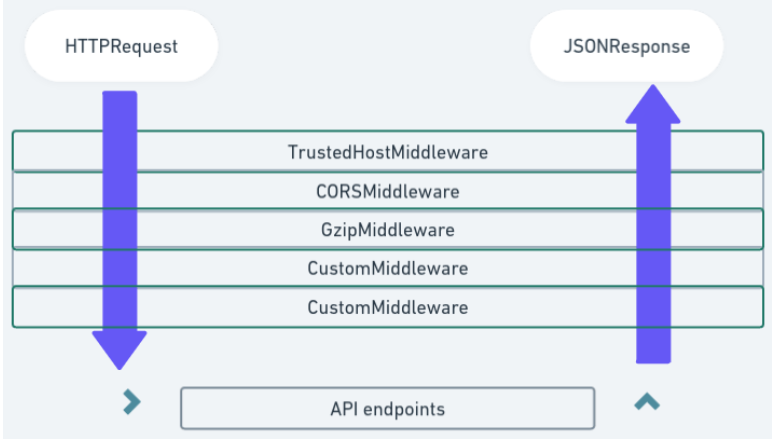

### Middleware



```python

@app.middleware("http")
async def add_process_time_header(request: Request, call_next):
    start_time = time.time()
    response = await call_next(request)
    process_time = time.time() - start_time
    response.headers["X-Process-Time"] = str(process_time) # custom header containing time in second
    return response
```

### CORS (Cross-Origin Resource SHaring)

**Origin**
- combination of protocol (http, https)
- domain (myapp.com, localhost, localhost.tiangolo.com)
- port (80, 443, 8080)

### Steps

+ First, we have `http://localhost:8080`   
+ Browser send **HTTP OPTIONS** ------request-----> **Backend**
+ Backend -----send headers authorizing----> different origin

**Backend must have a list of "allowed origins"**

### CORS Example

```python

from fastapi import FastAPI
# +++++++++++++++++++++++++++++++++++++++++++
from fastapi.middleware.cors import CORSMiddleware

app = FastAPI()

# ++++++++++++++++++++++++++++++++++++++
origins = [
    "http://localhost.tiangolo.com",
    "https://loc.....",
    "http://localhost",
    "http://localhost:8080"
]

# ++++++++++++++++++++++++++++++++++++++
app.add.middleware(
    CORSMiddleware,
    allow_origins=origins,
    allow_credentials=True,
    allow_methods=["*"],
    allow_headers=["*"],
)

```

### Function - based middleware: Request and Response Modification

- use **@app.middleware('http')** as function-based middleware
- receive tow parameters : **request and call_next**.
- when **call_next** response which is generated by endpoint,

```python

# at the import level
from fastapi import FastAPI, Request
from fastapi.responses import StreamingResponse

# after the `app` variable
@app.middleware("http")
async def modify_request_response_middleware(request: Request, call_next):
    # Intercept and modify the incoming request
    request.scope["path"] = str(request.url.path).replace("api", "apiv2")
    # Process the modified request
    response = await call_next(request)
    # Transform the outgoing response
    if isinstance(response, StreamingResponse):
        response.headers["X-Custom-Header"] = "Modified"
    return response

```

### Class-based middleware: Implementing Rate-Limiting

- crucial aspect of API performance and security
- make sure **class must be inherits from BaseHTTPMiddleware** class
- override the `async def dispatch(request, call_next)` to implement middleware logic
- override `__init__` method, make sure for configuration options

```python

# at the import level
from fastapi import FastAPI, Request
from fastapi.responses import StreamingResponse, JSONResponse
from starlette.middleware.base import BaseHTTPMiddleware
from datetime import datetime, timedelta

# immediately after imports
class RateLimitingMiddleware(BaseHTTPMiddleware):
    # Rate limiting configurations
    RATE_LIMIT_DURATION = timedelta(minutes=1)
    RATE_LIMIT_REQUESTS = 3

    def __init__(self, app):
        super().__init__(app)
        # Dictionary to store request counts for each IP
        self.request_counts = {}

    async def dispatch(self, request, call_next):
        # Get the client's IP address
        client_ip = request.client.host

        # Check if IP is already present in request_counts
        request_count, last_request = self.request_counts.get(client_ip, (0, datetime.min))

        # Calculate the time elapsed since the last request
        elapsed_time = datetime.now() - last_request

        if elapsed_time > self.RATE_LIMIT_DURATION:
            # If the elapsed time is greater than the rate limit duration, reset the count
            request_count = 1
        else:
            if request_count >= self.RATE_LIMIT_REQUESTS:
                # If the request count exceeds the rate limit, return a JSON response with an error message
                return JSONResponse(
                    status_code=429,
                    content={"message": "Rate limit exceeded. Please try again later."}
                )
            request_count += 1

        # Update the request count and last request timestamp for the IP
        self.request_counts[client_ip] = (request_count, datetime.now())

        # Proceed with the request
        response = await call_next(request)
        return response

```

### Why Logging Matters

Not only helps in **debugging issue** but also provide valuable insights into its **behavior, performance, and user interactions.**

1. Import the Necessary Modules
```python

import logging
from fastapi import FastAPI

```

2. Create a FastAPI App
```python

app = FastAPI()

```

3. Configure Logging (Different Log Levels)
- DEBUG: useful for debugging purpose
- INFO: general information about what's happening within the application
- WARNING: to indicate potential issues that could lead to problem
- ERROR: to signify errors that need immediate attention
- CRITICAL: reserve this level which could potentially bring entire app crashing down.

```python

logging.basicConfig(level=logging.DEBUG, filename='app.log', filemode='a', format='%(asctime)s - %(levelname)s - %(message)s')

```

4. Define Your FastAPI EndPoints
```python

@app.get("/")
async def read_root():
    logger.debug("Root endpoint accessed")
    return {"message": "Hello World"}

@app.get("/items/{item_id}")
async def read_item(item_id: int, q: str = None):
    logger.info(f"Item {item_id} requested")
    return {"item_id": item_id, "q": q}

```

5. Run Your FastAPI App
```python

if __name__ == "__main__":
    import uvicorn
    uvicorn.run(app, host="localhost", port=8000)

```